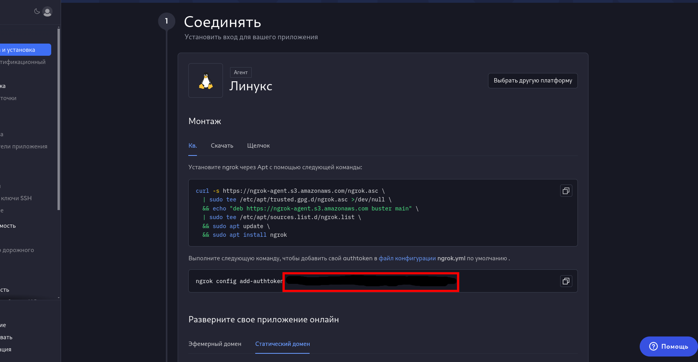

# Фейковый Шоп 2.0

## Описание проекта

**Фейковый шоп** - это _телеграм бот_, представляющий собой магазин аккаунтов. Он максимально похож на настоящий и полностью автономен.
Бот ведёт логи о пополнениях баланса и о новых пользователях.

## Установка

> Заказчик устанавливает бота на Windows, поэтому на Windows.

- Запустить [run.bat](run.bat) для установки [python 3.12](https://www.python.org/ftp/python/3.12.0/python-3.12.0-amd64.exe) и необходимых библиотек (`pip install -r requirements.txt`)
- Так как у бота имеются *webhook*, то необходимо для него домен. Бесплатный домен можно взять с помощью [ngrok](https://ngrok.com/)
  
  Регистрируемся на ngrok

  После переходим [сюда](https://dashboard.ngrok.com/get-started/setup/linux)

  Тут мы можем найти *токен ngrok*. Обведено красным прямоугольником

  

  Прокручиваем ниже и нажимаем на **Статический домен**. И находим *url вашего сайта* с webhook (замазано черным в красном нижнем прямоугольнике) 

  

  - Настроить под свои данные
    - В файле [.env](.env) вставляем значения
      
      - *BOT_TOKEN*=токен_бота
      - *CRYPTO_TOKEN*=токен_с_@send
      - *EPAY_TOKEN*=токен_с_e-pay.plus
      - *NGROK_TOKEN*=токен_с_ngrok
    - В файле [config.json](config.json) вставляем значения
      
      - *"admins_id"*: [id_2_админа, id_1_админа] 
      - *"url_ngrok"*: https://url_который_выше_находили"
      - *"epai_id"*: id_вашего_кабинета_e-pay.plus
    - Для редактирования текста переходим в директорию [locales](bot/locales)
    
      Для русского языка файлы для [user](bot/locales/ru/user.json) и для [admin](bot/locales/ru/admin.json)

      Для английского языка файлы для [user](bot/locales/en/user.json) и для [admin](bot/locales/en/admin.json)

      Где написано *\n* - это означает переход на новую строку

      Где написано {0}, {1} и т.д. - это в эти {} вставляются значения **(нельзя трогать)**

- Запускаем файлы [run_bot.py](run_bot.py) и [run_web.py](run_web.py)

## Используемые технологии

- **SQLAlchemy** - ORM БД 
- **python-dotenv** - работа с *.env*
- **aiogram** - работа с telegram
- **validators** - проверка на url
- **pendulum** - заменяет *datetime*
- **aiocryptopay** - работа с @send
- **betterconf** - работа с *.json*
- **ngrok** - работа с ngrok
- **uvicorn** - поднятие *FastAPI*
- **fastapi** - работа web-server
- **APScheduler** - работа с планировщиком задач
- **aiosqlite** - асинхронная бд *sqlite*

## Информация об разработчике: 

Разработчик кода писал все файлы ради спортивного-развлекательного интереса
